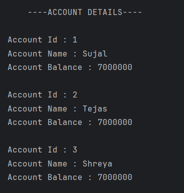

# Account Details Program

A simple Java program to demonstrate the use of **constructors**, **objects**, and **methods** in a class by displaying account information.

---

## 🧩 Features
- Uses a **parameterized constructor** to initialize account details  
- Demonstrates **object-oriented programming (OOP)** concepts  
- Displays multiple account details using the `display()` method  

---

## 💡 How It Works
1. The `Account_M` class contains:
   - Data members: `id`, `Name`, and `Balance`
   - A **constructor** to initialize these values
   - A `display()` method to print account details  
2. In the `Account` class:
   - Multiple `Account_M` objects are created with different details  
   - Each object's `display()` method is called to print information  

---

## 🖥️ Screenshot

---

## 🧑‍💻 Author
- **Sujal Patil**  
- **GitHub**: [SujalPatil21](https://github.com/SujalPatil21)  
- **Email**: sujalpatil21@gmail.com
