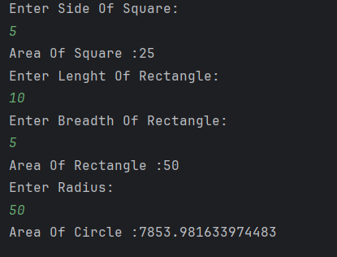

# Area Calculator (Method Overloading)
 
A simple Java program which demonstrates **method overloading** by calculating the areas of different shapes:  
- Square  
- Rectangle  
- Circle   
 
---
 
## Features
- Calculates the **area of a square** (using side length)  
- Calculates the **area of a rectangle** (using length and breadth)  
- Calculates the **area of a circle** (using radius)  
- Demonstrates the concept of **method overloading in Java**  

---

## How to Run
1. Open the project in any Java IDE (IntelliJ, Eclipse, VS Code) or terminal.  
2. Compile and run `Area.java`.  
3. Enter values for:
   - Side of a square  
   - Length and breadth of a rectangle  
   - Radius of a circle  
4. The program will display the calculated areas.  

---

## Screenshot

---

## Author
- **Sujal Patil**  
- **GitHub**: [SujalPatil21](https://github.com/SujalPatil21)  
- **Email**: sujalpatil21@gmail.com  
