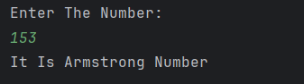

# Armstrong Number Checker

A simple Java program to **check if a given number is an Armstrong number**.  
An Armstrong number (also called a narcissistic number) is a number in which the sum of the cubes of its digits is equal to the number itself.  
For example:  
- 153 → 1³ + 5³ + 3³ = 153  
- 370 → 3³ + 7³ + 0³ = 370  

---

## Features
- Accepts a number as input from the user  
- Calculates the sum of cubes of digits  
- Compares the sum with the original number  
- Displays whether the number is Armstrong or not  

---

## How to Run
1. Open the project in any Java IDE (IntelliJ, Eclipse, VS Code) or terminal.  
2. Compile and run `Armstrong.java`.  
3. Enter a number when prompted.  
4. The program will display whether the entered number is an Armstrong number.  

---

## Screenshot

---

## Author
- **Sujal Patil**  
- **GitHub**: [SujalPatil21](https://github.com/SujalPatil21)  
- **Email**: sujalpatil21@gmail.com  
