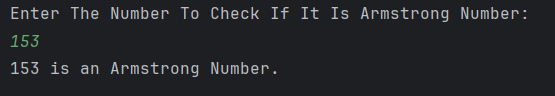

# Armstrong Number Checker (Recursion)

It is a Java program that checks whether a given number is an **Armstrong number** using **recursion**.

---

## Features
- Accepts an integer input from the user  
- Uses a recursive function to calculate the sum of cubes of its digits  
- Determines if the number is an **Armstrong number**  
- Displays a clear message whether the number is Armstrong or not  

---

## How It Works
1. User enters a number.  
2. The program calls the recursive method `Armstrong(num)` which:  
   - Extracts the last digit (`num % 10`)  
   - Computes the cube of the digit  
   - Recursively processes the remaining digits (`num / 10`)  
3. The sum of cubes is compared with the original number.  
4. If equal, the number is an **Armstrong number**; otherwise, it is not.  

---

## Screenshot

---

## Author
- **Sujal Patil**  
- **GitHub**: [SujalPatil21](https://github.com/SujalPatil21)  
- **Email**: sujalpatil21@gmail.com  
