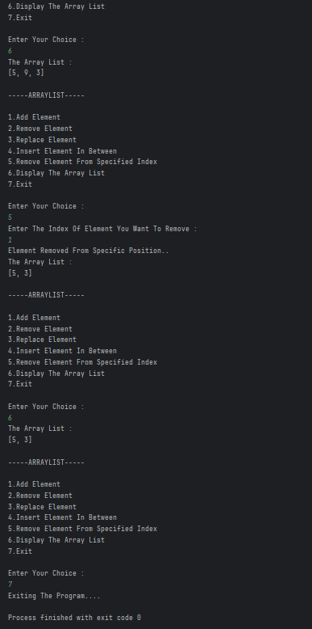

# ArrayList Operations Menu

A simple Java program that demonstrates common `ArrayList` operations using a user-friendly menu. Users can add, remove, replace, insert, and display elements in an `ArrayList`.

---

## 📂 Files
- `Main.java`

---

## 🧠 Concepts Used
- Java `ArrayList` operations: `add()`, `remove()`, `set()`, `add(index, element)`  
- `Scanner` for user input  
- Loops (`while`) and conditional statements (`switch-case`)  
- Boolean flags for controlling program flow

---

## 📸 Screenshot
  

---

## 👨‍💻 Author
**Sujal Patil**  
📧 Email: sujalpatil21@gmail.com  
🌐 GitHub: [SujalPatil21](https://github.com/SujalPatil21)
