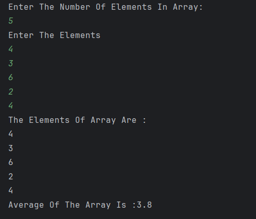

# Average of Array

A simple Java program that calculates the **average value of elements in an array** entered by the user.

---

## 🧮 Features
- Accepts the **number of elements** from the user.  
- Takes **array elements** as input.  
- Displays all the entered elements.  
- Calculates and prints the **average** of the array elements.  
- Demonstrates the use of **arrays**, **loops**, and **Scanner class** in Java.  

---

## ⚙️ How to Run
1. Open the project in any Java IDE (IntelliJ, Eclipse, VS Code) or use the terminal.  
2. Compile and run the file:  
   ```bash
   javac Average_Of_Array.java
   java Average_Of_Array


---

## Screenshot


---

## Author
- **Sujal Patil**  
- **GitHub**: [SujalPatil21](https://github.com/SujalPatil21)  
- **Email**: sujalpatil21@gmail.com


