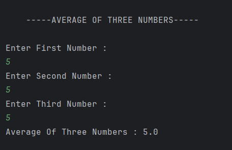

# Average Calculator

A simple Java program that calculates the **average of three numbers** entered by the user.

---

## Features
- Accepts **three numbers** from the user  
- Calculates the **average** using the formula `(a + b + c) / 3`  
- Displays the average on the console  

---

## How It Works
1. User enters three numbers one by one.  
2. The program sums the numbers and divides by 3 to find the average.  
3. The result is displayed on the console.  

---

## Screenshot

---

## Author
- **Sujal Patil**  
- **GitHub**: [SujalPatil21](https://github.com/SujalPatil21)  
- **Email**: sujalpatil21@gmail.com  
