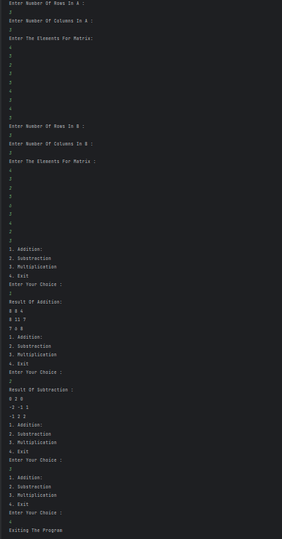

# 2D Array Matrix Calculator

A Java program that performs **matrix operations** (addition, subtraction, multiplication) using **2D arrays**. Users can input two matrices and choose the operation they want to perform.

---

## Features
- Accepts two matrices as input from the user  
- Performs **addition** of matrices (if dimensions match)  
- Performs **subtraction** of matrices (if dimensions match)  
- Performs **multiplication** of matrices (if compatible)  
- Provides a **menu-driven interface** to select operations  
- Displays the resulting matrix after the operation  

---

## How It Works
1. User enters the number of rows and columns for **Matrix A** and its elements.  
2. User enters the number of rows and columns for **Matrix B** and its elements.  
3. Program displays a menu:  
   - Addition  
   - Subtraction  
   - Multiplication  
   - Exit  
4. Based on user choice, the program performs the selected operation and prints the resulting matrix.  
5. The menu repeats until the user chooses **Exit**.  

---

## Screenshot

---

## Author
- **Sujal Patil**  
- **GitHub**: [SujalPatil21](https://github.com/SujalPatil21)  
- **Email**: sujalpatil21@gmail.com  

