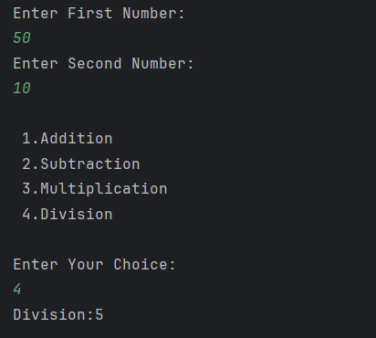

# Calculator Using Switch Case

A simple Java program that works as a **basic calculator**.  
It accepts two numbers and performs the selected operation: **Addition, Subtraction, Multiplication, or Division**.

---

## Features
- Accepts two numbers as input from the user  
- Provides a menu with four operations:  
  1. Addition  
  2. Subtraction  
  3. Multiplication  
  4. Division  
- Displays the result of the selected operation  

---

## How to Run
1. Open the project in any Java IDE (IntelliJ, Eclipse, VS Code) or terminal.  
2. Compile and run `Calculator.java`.  
3. Enter two numbers when prompted.  
4. Select an operation from the menu.  
5. The program will display the result.  

---

## Screenshot

---

## Author
- **Sujal Patil**  
- **GitHub**: [SujalPatil21](https://github.com/SujalPatil21)  
- **Email**: sujalpatil21@gmail.com
