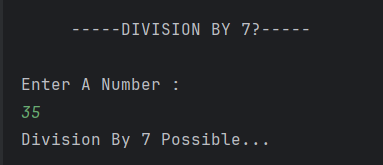

# Division by 7 Checker

It simple Java program that checks whether a given number is divisible by **7**.

---

## Features
- Accepts an integer input from the user  
- Checks if the number is divisible by 7 using the modulus operator (`%`)  
- Displays a message indicating whether division by 7 is possible or not  

---

## How It Works
1. User enters a number.  
2. The program uses the condition `a % 7 == 0` to check divisibility.  
3. If true, it prints "Division By 7 Possible..."  
4. If false, it prints "Division By 7 Not Possible..."  

---

## Screenshot

---

## Author
- **Sujal Patil**  
- **GitHub**: [SujalPatil21](https://github.com/SujalPatil21)  
- **Email**: sujalpatil21@gmail.com  
