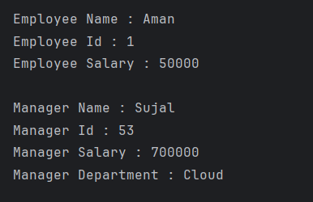

# Employee and Manager Inheritance Program

This Java program demonstrates the concept of **Inheritance** using two classes — `Employee` and `Manager`.  
Each class is created in a separate file to maintain proper object-oriented structure.

---

## 📂 Files
- **Employee.java**
- **Manager.java**
- **Main.java**

---

## 🧠 Concept Used
- **Inheritance**
- **Constructor Chaining**
- **Method Overriding**

---

## 📸 Screenshot

---

## 👨‍💻 Author
**Sujal Patil**  
📧 Email: sujalpatil21@gmail.com  
🌐 GitHub: [SujalPatil21](https://github.com/SujalPatil21)

