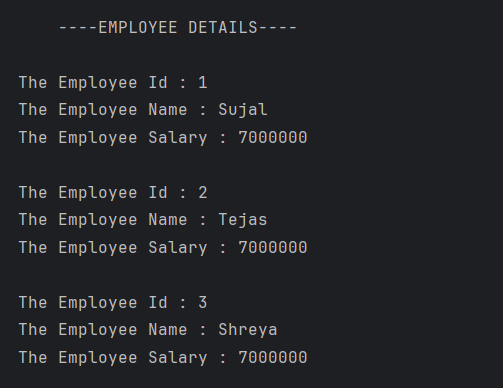

# Employee Details  

A simple Java program that demonstrates the use of **classes, objects, constructors, methods, and the `this` keyword** in Java.  
The program stores and displays employee details such as **ID, name, and monthly salary**, and also calculates their **annual salary**.  

---

## Features  
- Defines an **Employee_D class** with:  
  - Employee ID  
  - Employee Name  
  - Employee Salary  
- Uses a **constructor** to initialize employee details.  
- Uses the **`this` keyword** to differentiate instance variables.  
- Provides a `display()` method to print employee details.  
- Provides a `calculateAnnualSalary()` method to compute the annual salary.  

---

## How to Run  
1. Open the project in any Java IDE (IntelliJ, Eclipse, VS Code) or terminal.  
2. Compile and run `Employee.java`.  
3. The program will display details of employees along with their annual salary.  

---

## Screenshot  
  

---

## Author  
- **Sujal Patil**  
- **GitHub**: [SujalPatil21](https://github.com/SujalPatil21)  
- **Email**: sujalpatil21@gmail.com  
