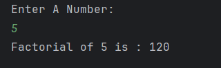

# Factorial Calculator

It is a simple Java program to **calculate the factorial of a number**.  
The user provides a number, and the program calculates its factorial using a loop.

---

## Features
- Accepts a number as input from the user  
- Calculates factorial using iteration  
- Displays the result clearly  

---

## How to Run
1. Open the project in any Java IDE (IntelliJ, Eclipse, VS Code) or terminal.  
2. Compile and run `Factorial.java`.  
3. Enter a number when prompted.  
4. The program will display the factorial of the given number.  

---

## Screenshot

---

## Author
- **Sujal Patil**  
- **GitHub**: [SujalPatil21](https://github.com/SujalPatil21)  
- **Email**: sujalpatil21@gmail.com
