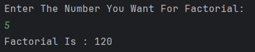

# Factorial Calculator (Recursion)

A simple Java program that calculates the **factorial of a number** using **recursion**.  

---

## Features
- Takes an integer input from the user  
- Uses a recursive function to compute factorial  
- Prints the factorial result  

---

## How It Works
1. User enters a number.  
2. The program calls the recursive method `factorial(num)`.  
3. The recursion continues until it reaches the base case (`num == 1`).  
4. The final factorial value is returned and displayed.  

---

## Screenshot

---

## Author
- **Sujal Patil**  
- **GitHub**: [SujalPatil21](https://github.com/SujalPatil21)  
- **Email**: sujalpatil21@gmail.com  

