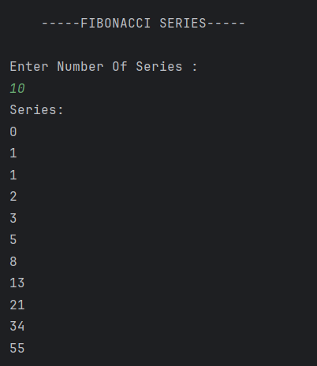

# Fibonacci Series Program

A simple Java program to generate the **Fibonacci series** up to a user-defined number using loops and variables.

---

## 🧩 Features
- Takes user input for the **number of terms**  
- Uses **iteration (for loop)** to generate the series  
- Demonstrates **basic logic building** and **loop control** in Java  
- Prints the Fibonacci sequence starting from 0 and 1  

---

## 💡 How It Works
1. The program asks the user to enter how many terms of the Fibonacci series to display.  
2. It initializes the first two numbers:  
   - `a = 0` (first term)  
   - `b = 1` (second term)  
3. Using a `for` loop, it calculates the next term by summing the previous two (`c = a + b`).  
4. Each term is printed until the desired number of terms is reached.  

---

## 🖥️ Output

---

## 🧑‍💻 Author
- **Sujal Patil**  
- **GitHub**: [SujalPatil21](https://github.com/SujalPatil21)  
- **Email**: sujalpatil21@gmail.com
