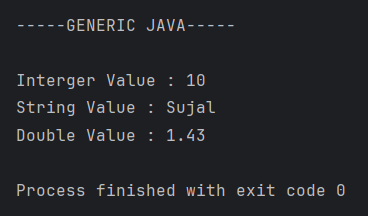

# Generic Java Program
A simple program demonstrating Java Generics using a custom generic class that stores different data types.

---

## 📂 Files
- Main.java
- Generic.java

---

## 🧠 Concept Used
- Java Generics (`<T>`)
- Class & Object Creation
- Getter and Setter Methods
- Type Safety and Reusability

---

## 📸 Screenshot

---

## 👨‍💻 Author
**Sujal Patil**  
📧 Email: sujalpatil21@gmail.com  
🌐 GitHub: [SujalPatil21](https://github.com/SujalPatil21)
