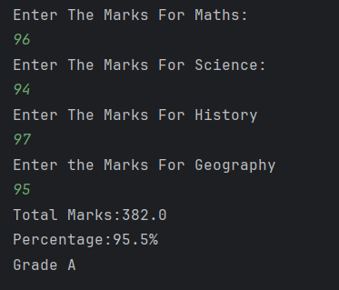

# Grade Calculator

A simple Java program to **calculate the grade of a student** based on marks entered for multiple subjects.  
It accepts input for Maths, Science, History, and Geography, calculates the total, average, and displays the corresponding grade.

---

## Features
- Accepts marks for four subjects from the user  
- Calculates total and average marks  
- Assigns a grade based on the average:
  
  - A: 90–100
  - B: 80–89
  - C: 70–79
  - D: 60–69
  - E: 50–59
  - F: Below 50  
- Displays results clearly in the console  

---

## How to Run
1. Open the project in any Java IDE (IntelliJ, Eclipse, VS Code).  
2. Compile and run `Grade.java`.  
3. Enter marks for each subject when prompted.  
4. The program will display the total, average, and grade.  

---

## Screenshot

---

## Author
- **Sujal Patil**  
- **GitHub**: [SujalPatil21](https://github.com/SujalPatil21)  
- **Email**: sujalpatil21@gmail.com
