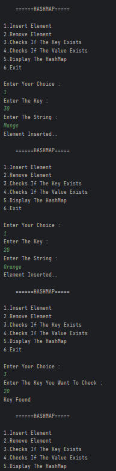
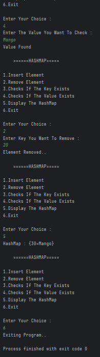

# HashMap Operations
A simple Java program that performs insertion, removal, key lookup, value lookup, and display operations on a `HashMap`.

---

## 📂 Files
- Main.java

---

## 🧠 Concept Used
- HashMap  
- Scanner  
- Switch Case  
- CRUD Operations  
- Input Handling (`nextInt()` / `nextLine()`)

---

## 📸 Screenshot
  

---

## 👨‍💻 Author
**Sujal Patil**  
📧 Email: sujalpatil21@gmail.com  
🌐 GitHub: [SujalPatil21](https://github.com/SujalPatil21)
