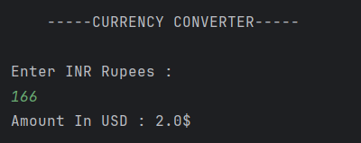

# Currency Converter (INR to USD)

A simple Java program that converts an amount in **Indian Rupees (INR)** to **US Dollars (USD)**.

---

## Features
- Accepts an amount in **INR** from the user  
- Converts the amount to **USD** using a fixed conversion rate (1 USD = 83 INR)  
- Displays the converted amount  

---

## How It Works
1. User enters the amount in INR.  
2. The program divides the INR amount by 83 to get the equivalent USD.  
3. The result is displayed on the console in dollars (`$`).  

---

## Screenshot

---

## Author
- **Sujal Patil**  
- **GitHub**: [SujalPatil21](https://github.com/SujalPatil21)  
- **Email**: sujalpatil21@gmail.com  
