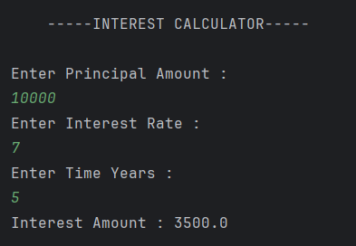

# Interest Calculator

A simple Java program that calculates **Simple Interest** based on the **Principal Amount**, **Rate of Interest**, and **Time (in years)** entered by the user.  

---

## 🧮 Features
- Accepts **Principal**, **Rate**, and **Time** as user input.  
- Calculates **Simple Interest** using the formula:  
  \[
  \text{Interest} = \frac{Principal \times Rate \times Time}{100}
  \]  
- Displays the **calculated interest amount** clearly.  
- Demonstrates the use of **Scanner class** for input handling in Java.  

---

## ▶️ How to Run
1. Open the project in any Java IDE (IntelliJ, Eclipse, VS Code) or use the terminal.  
2. Compile and run the program file:  
   ```bash
   javac Interest.java
   java Interest


---

## Output


---

## Author
- **Sujal Patil**  
- **GitHub**: [SujalPatil21](https://github.com/SujalPatil21)  
- **Email**: sujalpatil21@gmail.com  

