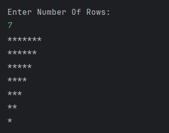

# Inverted Right-Angled Star Pattern

A simple Java program to **print an inverted right-angled triangle star pattern**.  
The program takes the number of rows as input and prints the pattern using nested loops.

---

## Features
- Accepts the number of rows as input from the user  
- Uses nested loops to generate the star pattern  
- Easy to understand for beginners in Java  

---

## How to Run
1. Open the project in any Java IDE (IntelliJ, Eclipse, VS Code) or terminal.  
2. Compile and run `Inverted_Right_Angle.java`.  
3. Enter the number of rows when prompted.  
4. The program will display the inverted right-angled triangle pattern.  

---

## Screenshot

---

## Author
- **Sujal Patil**  
- **GitHub**: [SujalPatil21](https://github.com/SujalPatil21)  
- **Email**: sujalpatil21@gmail.com  
