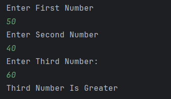

# Largest of Three Numbers

IT is a simple Java program to **find the largest among three numbers** entered by the user.  
It uses conditional statements (`if-else`) to compare the three numbers.

---

## Features
- Accepts three numbers as input from the user  
- Compares the numbers using logical operators (`&&`)  
- Displays which number is the greatest  

---

## How to Run
1. Open the project in any Java IDE (IntelliJ, Eclipse, VS Code) or terminal.  
2. Compile and run `Largest_Number_Of_Three.java`.  
3. Enter three numbers when prompted .  
4. The program will display which number is the largest.  

---

## Screenshot

---

## Author
- **Sujal Patil**  
- **GitHub**: [SujalPatil21](https://github.com/SujalPatil21)  
- **Email**: sujalpatil21@gmail.com  
