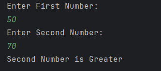

# Largest of Two Numbers

A simple Java program to **find the largest of two numbers** entered by the user.  
It compares the two numbers and displays which one is greater.

---

## Features
- Accepts two numbers as input from the user  
- Compares the numbers  
- Displays which number is greater (or if both are equal, can be added as improvement)  
- Simple and beginner-friendly  

---

## How to Run
1. Open the project in any Java IDE (IntelliJ, Eclipse, VS Code).  
2. Compile and run `Largest_Of_Two_Numbers.java`.  
3. Enter two numbers when prompted.  
4. The program will display which number is greater.  

---

## Screenshot

---

## Author
- **Sujal Patil**  
- **GitHub**: [SujalPatil21](https://github.com/SujalPatil21)  
- **Email**: sujalpatil21@gmail.com
