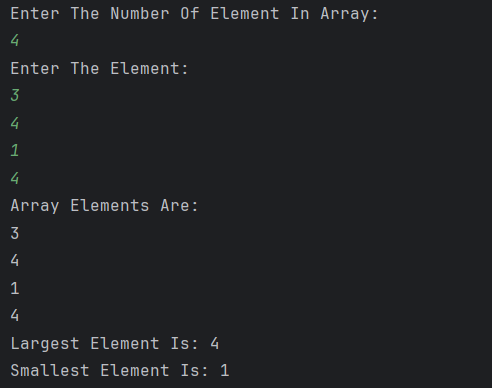

# Array Largest and Smallest Finder

A simple Java program to **find the largest and smallest elements in an array**.  
The program takes array elements as input from the user and calculates the largest and smallest values.

---

## Features
- Accepts the number of elements and array values from the user  
- Displays all the array elements  
- Finds and displays the largest element using `Math.max`  
- Finds and displays the smallest element using `Math.min`  

---

## How to Run
1. Open the project in any Java IDE (IntelliJ, Eclipse, VS Code) or terminal.  
2. Compile and run `Array.java`.  
3. Enter the number of elements in the array.  
4. Enter the elements one by one.  
5. The program will display the array, the largest element, and the smallest element.  

---

## Screenshot

---

## Author
- **Sujal Patil**  
- **GitHub**: [SujalPatil21](https://github.com/SujalPatil21)  
- **Email**: sujalpatil21@gmail.com  
