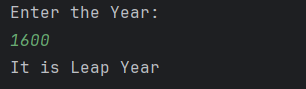

# Leap Year Checker

A simple Java program to check whether a given year is a leap year or not.  
It accepts user input from the console and demonstrates the use of **conditional statements**, **arithmetic operators**, and **variables**.

## Features

- Accepts any year as input from the user
- Determines if the year is a leap year based on:
  - Divisible by 4 and not divisible by 100, or
  - Divisible by 400
- Prints clear output to the console

## How to Run

1. Open the project in any Java IDE (IntelliJ, Eclipse, VS Code).  
2. Compile and run `LeapYearChecker.java`.  
3. Enter a year when prompted.  
4. The program will display whether the year is a leap year or not.

## Screenshot

## Author
- **Sujal Patil**  
- **GitHub**: [SujalPatil21](https://github.com/SujalPatil21)  
- **Email**: sujalpatil21@gmail.com  

