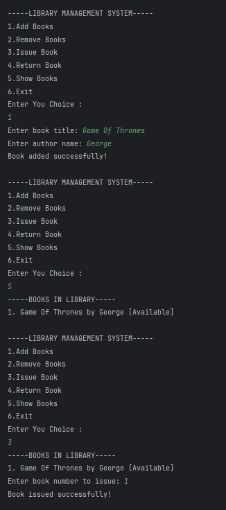
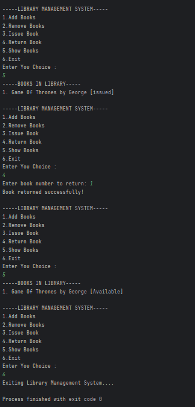

# Library Management System

A Java program that simulates a simple **Library Management System** to manage books, issue, return, and display book details.

---

## 📂 Files
- **Library.java**

---

## 🧠 Concept Used
- **Arrays** to store book titles, authors, and issue status  
- **Static methods** for various library operations  
- **Conditional statements and loops** for menu-driven program  
- **Scanner class** for user input  

---

## 📸 Screenshot
  

---

## 👨‍💻 Author
**Sujal Patil**  
📧 Email: sujalpatil21@gmail.com  
🌐 GitHub: [SujalPatil21](https://github.com/SujalPatil21)
