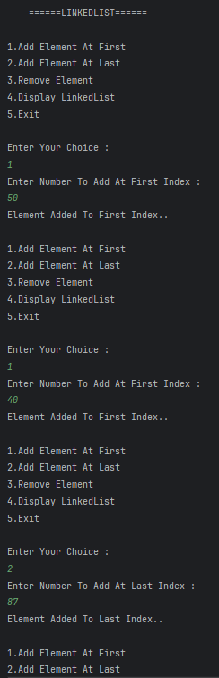
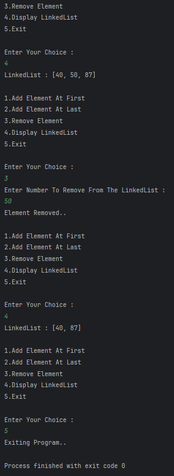

# LinkedList Operations in Java
A simple Java program demonstrating basic **LinkedList operations** such as adding elements at the first and last positions, removing elements by value, and displaying the list.

---

## 📂 Files
- Main.java

---

## 🧠 Concept Used
- `LinkedList` class from `java.util` package  
- Adding elements: `addFirst()`, `addLast()`  
- Removing elements by value: `remove(Object)`  
- Displaying the LinkedList  
- Scanner for user input  
- Switch-case for menu-driven program  

---

## 📸 Screenshot
  

---

## 👨‍💻 Author
**Sujal Patil**  
📧 Email: sujalpatil21@gmail.com  
🌐 GitHub: [SujalPatil21](https://github.com/SujalPatil21)

