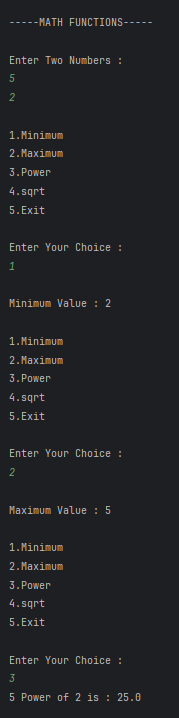
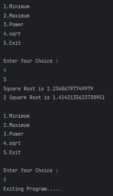

# Math Functions Program
A Java program demonstrating various mathematical operations such as finding minimum, maximum, power, and square root using the `Math` class.

---

## 📂 Files
- `Main.java`  
- `Output1.png`  
- `Output2.png`

---

## 🧠 Concept Used
- `Scanner` class for user input  
- `switch` statement for menu-driven program  
- `Math` class static methods (`min()`, `max()`, `pow()`, `sqrt()`)  
- `while` loop for repeated operations  

---

## 📸 Screenshot

---

## 👨‍💻 Author
**Sujal Patil**  
📧 Email: sujalpatil21@gmail.com  
🌐 GitHub: [SujalPatil21](https://github.com/SujalPatil21)
