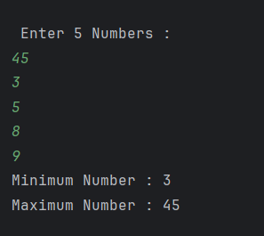

# Find Minimum and Maximum Number  
A Java program takes 5 numbers as input from the user and finds the **minimum** and **maximum** values among them using an array and comparison logic.

---

## 📂 Files  
- `Main.java`

---

## 🧠 Concept Used  
- **Arrays** – to store user inputs  
- **Loops** (`for`) – to iterate through array elements  
- **Conditional Statements** (`if`) – to compare numbers  
- **Scanner Class** – to take user input from the console  

---

## 📸 Screenshot  

---

## 👨‍💻 Author  
**Sujal Patil**  
📧 Email: sujalpatil21@gmail.com  
🌐 GitHub: [SujalPatil21](https://github.com/SujalPatil21)

