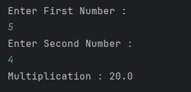

# Multiplication Calculator

A basic Java program that multiplies two numbers provided by the user.

---

## Features
- Accepts **two numbers** from the user  
- Performs **multiplication** of the numbers  
- Displays the result  

---

## How It Works
1. User is prompted to enter the **first number**.  
2. User is prompted to enter the **second number**.  
3. The program multiplies the two numbers and stores the result.  
4. The multiplication result is displayed on the console.  

---

## Screenshot

---

## Author
- **Sujal Patil**  
- **GitHub**: [SujalPatil21](https://github.com/SujalPatil21)  
- **Email**: sujalpatil21@gmail.com  
