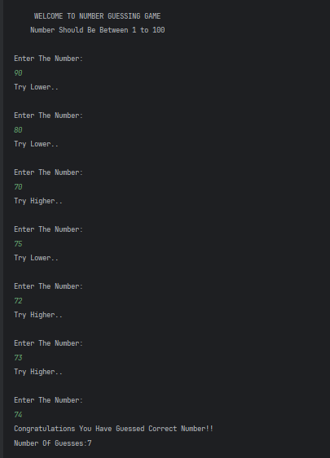

# Number Guessing Game (Advanced)

A Java program where the user tries to guess a randomly generated number between **1 and 100** with **higher/lower hints**.  

---

## Features
- Randomly generates a number using `Math.random()`  
- Prompts the user to guess the number  
- Gives feedback whether the guess is **higher** or **lower**  
- Counts the number of attempts  
- Congratulates the user when the correct number is guessed  

---

## How It Works
1. The program generates a random number between 1 and 100.  
2. The user enters guesses in a loop.  
3. Program compares the guess with the generated number:  
   - If guess is higher → prompts "Try Lower.."  
   - If guess is lower → prompts "Try Higher.."  
4. The loop continues until the user guesses the correct number.  
5. Displays a congratulatory message and the total number of guesses.  

---

## Screenshot

---

## Author
- **Sujal Patil**  
- **GitHub**: [SujalPatil21](https://github.com/SujalPatil21)  
- **Email**: sujalpatil21@gmail.com  
