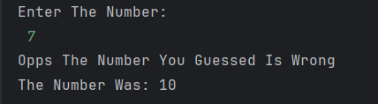

# Number Guessing Game

A simple Java program where the user tries to **guess a randomly generated number** between 1 and 10.  
The program checks the user's guess and tells whether it is correct or not.

---

## Features
- Generates a random number between 1 and 10  
- Accepts the user's guess as input  
- Checks if the guess is correct  
- Displays the correct number if the guess is wrong  

---

## How to Run
1. Open the project in any Java IDE (IntelliJ, Eclipse, VS Code) or terminal.  
2. Compile and run `Guess.java`.  
3. Enter a number between 1 and 10 when prompted.  
4. The program will tell you if your guess is correct and display the actual number.  

---

## Screenshot

---

## Author
- **Sujal Patil**  
- **GitHub**: [SujalPatil21](https://github.com/SujalPatil21)  
- **Email**: sujalpatil21@gmail.com  
