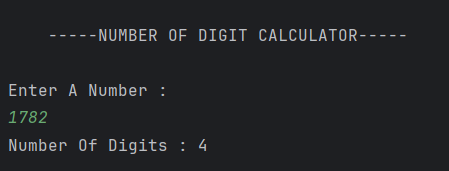

# Number Of Digit Calculator Program

A simple Java program to count the **number of digits** in a user-entered integer using loops and division operations.

---

## 🧩 Features
- Takes user input for any integer number  
- Uses a **while loop** to count the digits  
- Demonstrates **looping** and **arithmetic operations** in Java  
- Displays the total count of digits in the given number  

---

## 💡 How It Works
1. The program prompts the user to enter an integer number.  
2. It stores the number in the variable `num` and copies it to `temp`.  
3. Using a `while` loop, it repeatedly divides the number by 10 until it becomes 0.  
4. Each iteration increases the counter `count` by 1.  
5. Finally, it prints the total number of digits in the input number.  

---

## 🖥️ Output

---

## 🧑‍💻 Author
- **Sujal Patil**  
- **GitHub**: [SujalPatil21](https://github.com/SujalPatil21)  
- **Email**: sujalpatil21@gmail.com
