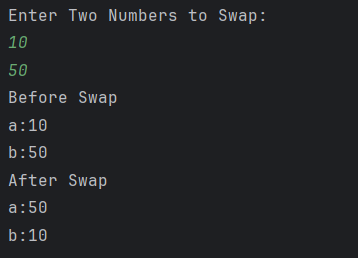

# Number Swap Program

A simple Java program to **swap two numbers** using a temporary variable.  
It accepts input from the user, shows the numbers before swapping, and then displays them after swapping.

---

## Features
- Accepts two numbers as input from the user  
- Swaps the values of the numbers using a temporary variable  
- Displays values clearly before and after the swap  

---

## How to Run
1. Open the project in any Java IDE (IntelliJ, Eclipse, VS Code).  
2. Compile and run `Swap.java`.  
3. Enter two numbers when prompted.  
4. The program will display the values before and after swapping.  

---

## Screenshot

---

## Author
- **Sujal Patil**  
- **GitHub**: [SujalPatil21](https://github.com/SujalPatil21)  
- **Email**: sujalpatil21@gmail.com  
