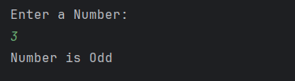

# Odd Even Checker

A simple Java program to check whether a given number is **odd or even**.  
It accepts user input from the console and demonstrates the use of **conditional statements**, **arithmetic operators**, and **variables**.

## Features

- Accepts any number as input from the user
- Determines if the number is **odd** or **even**
- Prints clear output to the console

## How to Run

1. Open the project in any Java IDE (IntelliJ, Eclipse, VS Code).  
2. Compile and run `Odd_Even.java`.  
3. Enter a number when prompted.  
4. The program will display whether the number is odd or even.

## Screenshot

## Author

Sujal Patil
