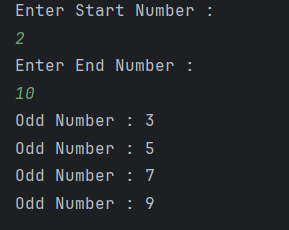

# Odd Number Finder

The simple Java program that prints all **odd numbers** within a given range.

---

## Features
- Accepts a **start** and **end** number from the user  
- Iterates through the range to find **odd numbers**  
- Displays each odd number on the console  

---

## How It Works
1. User enters the **start** and **end** numbers.  
2. The program uses a `for` loop to iterate through the range.  
3. Each number is checked using the condition `i % 2 != 0`.  
4. If true, the number is **odd** and printed on the console.  

---

## Screenshot

---

## Author
- **Sujal Patil**  
- **GitHub**: [SujalPatil21](https://github.com/SujalPatil21)  
- **Email**: sujalpatil21@gmail.com  
