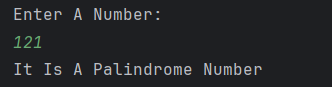

# Number Palindrome Checker

A simple Java program to **check whether a number is a palindrome**.  
It accepts an integer input from the user and determines whether it reads the same backward as forward.

---

## Features
- Accepts a number as input from the user  
- Checks if the number is a palindrome using a loop  
- Displays a clear message indicating whether the number is a palindrome or not  

---

## How to Run
1. Open the project in any Java IDE (IntelliJ, Eclipse, VS Code) or terminal.  
2. Compile and run `Palindrome.java`.  
3. Enter a number when prompted.  
4. The program will display whether the number is a palindrome or not.  

---

## Screenshot

---

## Author
- **Sujal Patil**  
- **GitHub**: [SujalPatil21](https://github.com/SujalPatil21)  
- **Email**: sujalpatil21@gmail.com
