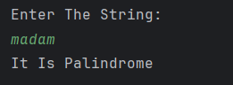

# String Palindrome Checker

A simple Java program to **check whether a string is a palindrome**.  
It accepts a word or phrase from the user and determines whether it reads the same backward as forward.

---

## Features
- Accepts a string input from the user  
- Reverses the string using a loop  
- Compares the original and reversed strings  
- Displays whether the string is a palindrome or not  

---

## How to Run
1. Open the project in any Java IDE (IntelliJ, Eclipse, VS Code) or terminal.  
2. Compile and run `Palindrome_String.java`.  
3. Enter a string when prompted.  
4. The program will display whether it is a palindrome.  

---

## Screenshot

---

## Author
- **Sujal Patil**  
- **GitHub**: [SujalPatil21](https://github.com/SujalPatil21)  
- **Email**: sujalpatil21@gmail.com
