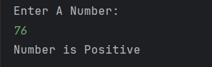

# Positive or Negative Number Checker

A simple Java program to **check whether a number is positive, negative, or zero**.  
It accepts an integer input from the user and displays the result accordingly.

---

## Features
- It Accepts a number from the user  
- Checks whether the number is:
  - Positive  
  - Negative  
  - Zero  
- Displays results clearly in the console  

---

## How to Run
1. Open the project in any Java IDE (IntelliJ, Eclipse, VS Code).  
2. Compile and run `Positive_Or_Negative.java`.  
3. Enter a number when prompted.  
4. The program will display whether the number is positive, negative, or zero.  

---

## Screenshot

---

## Author
- **Sujal Patil**  
- **GitHub**: [SujalPatil21](https://github.com/SujalPatil21)  
- **Email**: sujalpatil21@gmail.com
