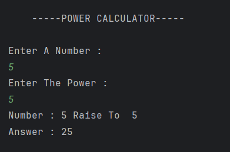

# Power Calculator Program

A simple Java program to calculate the **power of a number** using user input values for the base and exponent.

---

## 🧩 Features
- Takes user input for both **base number** and **power**  
- Demonstrates **basic arithmetic operations** in Java  
- Uses **Scanner class** for input handling  
- Displays the calculated power result  

---

## 💡 How It Works
1. The program prompts the user to enter a base number and the power (exponent).  
2. It stores these values in variables `num` and `power`.  
3. The result is calculated by multiplying the base with the power value.  
4. Finally, it displays the base, exponent, and result on the console.  

---

## 🖥️ Output

---

## 🧑‍💻 Author
- **Sujal Patil**  
- **GitHub**: [SujalPatil21](https://github.com/SujalPatil21)  
- **Email**: sujalpatil21@gmail.com
