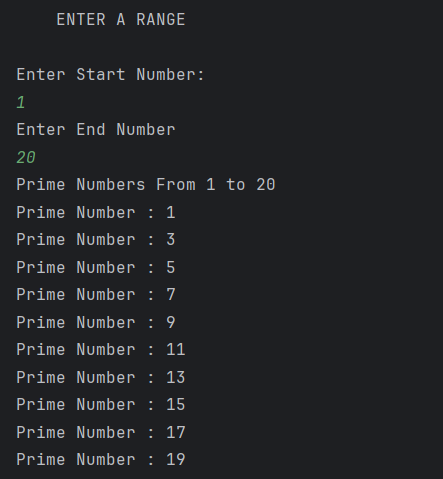

# Prime Number Finder

A simple Java program that finds and prints all **prime numbers** within a given range.

---

## Features
- Accepts a start and end number from the user  
- Checks each number in the range to see if it is prime  
- Uses a separate method `isPrime()` for prime number checking  
- Displays all prime numbers in the given range  

---

## How It Works
1. User enters the **start** and **end** numbers.  
2. The program iterates through all numbers in the range.  
3. Each number is passed to the `isPrime()` method:  
   - Returns `false` for numbers less than 2  
   - Checks divisibility from 2 to √number  
   - Returns `true` if no divisors are found  
4. Prime numbers are printed on the console.  

---

## Screenshot

---

## Author
- **Sujal Patil**  
- **GitHub**: [SujalPatil21](https://github.com/SujalPatil21)  
- **Email**: sujalpatil21@gmail.com  
