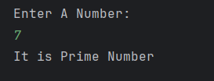

# Prime Number Checker

A simple Java program to **check whether a number is prime or not**.  
It accepts an integer input from the user and displays whether the number is prime or not.

---

## Features
- Accepts a number from the user  
- Checks if the number is prime using a loop  
- Prints whether the number is prime or not  

---

## How to Run
1. Open the project in any Java IDE (IntelliJ, Eclipse, VS Code) or terminal.  
2. Compile and run `Prime_Number.java`.  
3. Enter a number when prompted.  
4. The program will display whether the number is prime or not.  

---

## Screenshot

---

## Author
- **Sujal Patil**  
- **GitHub**: [SujalPatil21](https://github.com/SujalPatil21)  
- **Email**: sujalpatil21@gmail.com
