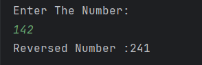

# Reverse Number

A simple Java program to **reverse a given number**.  
The program takes a number as input and prints its digits in reverse order.

---

## Features
- Accepts a number from the user  
- Reverses the number using a `while` loop  
- Displays the reversed number clearly  

---

## How to Run
1. Open the project in any Java IDE (IntelliJ, Eclipse, VS Code) or terminal.  
2. Compile and run `Reverse.java`.  
3. Enter the number you want to reverse when prompted.  
4. The program will display the reversed number.  

---

## Screenshot

---

## Author
- **Sujal Patil**  
- **GitHub**: [SujalPatil21](https://github.com/SujalPatil21)  
- **Email**: sujalpatil21@gmail.com  
