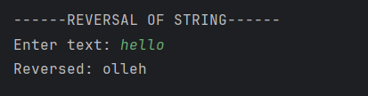

# String Reversal Program
A simple Java program to reverse any string input by the user.

---

## 📂 Files
- `Main.java`

---

## 🧠 Concept Used
- Taking input from the user using `Scanner`.
- Using `StringBuilder` to reverse a string.
- Printing output to the console.

---

## 📸 Screenshot

---

## 👨‍💻 Author
**Sujal Patil**  
📧 Email: sujalpatil21@gmail.com  
🌐 GitHub: [SujalPatil21](https://github.com/SujalPatil21)

