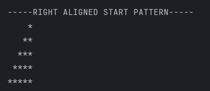

# Right Aligned Star Pattern  
This program prints a **right-aligned star pattern** based on the number of rows specified in the code.

---

## 📂 Files  
- `Main.java`

---

## 🧠 Concept Used  
- Nested `for` loops  
- Pattern printing  
- Conditional iteration logic  
- Console output using `System.out.print()` and `System.out.println()`

---

## 📸 Screenshot  

---

## 👨‍💻 Author  
**Sujal Patil**  
📧 Email: sujalpatil21@gmail.com  
🌐 GitHub: [SujalPatil21](https://github.com/SujalPatil21)

