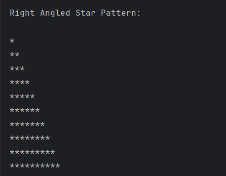

# Right Angled Star Pattern

A simple Java program to **print a right-angled triangle star pattern**.  
The program uses nested loops to generate a triangle made of stars (`*`).

---

## Features
- Prints a right-angled triangle of stars  
- Uses nested loops for pattern generation  
- Easy to understand for beginners in Java  

---

## How to Run
1. Open the project in any Java IDE (IntelliJ, Eclipse, VS Code) or terminal.  
2. Compile and run `Star.java`.  
3. The program will display a star pattern of 10 rows.  

---

## Screenshot

---

## Author
- **Sujal Patil**  
- **GitHub**: [SujalPatil21](https://github.com/SujalPatil21)  
- **Email**: sujalpatil21@gmail.com  
