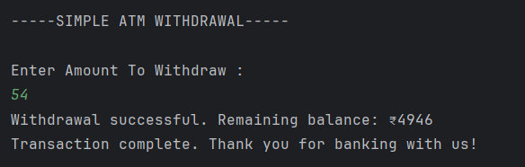
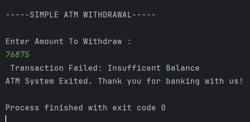

# Simple ATM Withdrawal  
A Java program that simulates an ATM withdrawal system using **exception handling**.  
It validates withdrawal amounts, manages balance, and demonstrates both **built-in** and **custom exceptions**.

---

## 📂 Files
- `Main.java`

---

## 🧠 Concept Used
- `try-catch-finally` blocks  
- **Custom Exception** (`InsufficientBalanceException`)  
- **Built-in Exception** (`IllegalArgumentException`)  
- Input handling using `Scanner`  
- Control flow for safe transaction management  

---

## 📸 Screenshot
**Output 1:**  

**Output 2:**  

---

## ⚙️ Methodology
1. User enters the amount to withdraw.  
2. The program checks for invalid or excessive withdrawal.  
3. If valid, balance is updated; otherwise, an appropriate exception is thrown.  
4. All exceptions are caught, and a final message is displayed using the `finally` block.

---

## 🧩 3-Line Theory
> Exception handling separates normal execution from error management.  
> Custom exceptions make error messages meaningful and specific.  
> Using `try-catch-finally` ensures smooth program flow even after runtime issues.

---

## 👨‍💻 Author
**Sujal Patil**  
📧 Email: sujalpatil21@gmail.com  
🌐 GitHub: [SujalPatil21](https://github.com/SujalPatil21)
