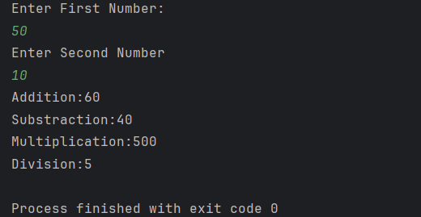

# Simple Calculator

A beginner-friendly Java program that performs **basic arithmetic operations** (Addition, Subtraction, Multiplication, Division).  
It accepts two numbers from the user and displays the results directly in the console.

---

## Features
- Accepts two numbers as input from the user  
- Performs **Addition, Subtraction, Multiplication, and Division**  
- Prints clear results to the console  

---

## How to Run
1. Open the project in any Java IDE (IntelliJ, Eclipse, VS Code).  
2. Compile and run `Calculator.java`.  
3. Enter two numbers when prompted.  
4. The program will display the result of all arithmetic operations.  

---

## Screenshot

---

## Author
- **Sujal Patil**  
- [GitHub Profile](https://github.com/SujalPatil21)  
- sujalpatil21@gmail.com  
