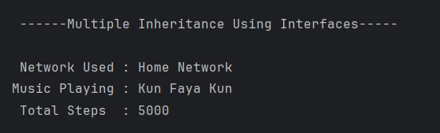

# Smart Device Interfaces
A Java program demonstrating the use of **multiple interfaces** and their implementation within a single class to achieve *multiple inheritance* in Java.

---

## 📂 Files
- `WifiConnectable.java` – Interface for Wi-Fi connectivity functionality.  
- `MusicPlayable.java` – Interface for music-playing capability.  
- `HealthTrackable.java` – Interface for health tracking features.  
- `Main.java` – Main class that implements all three interfaces and demonstrates their usage.

---

## 🧠 Concept Used
- Multiple Interfaces in Java  
- Interface Implementation  
- Polymorphism  
- OOP Principles  

---

## 📸 Screenshot

---

## 👨‍💻 Author
**Sujal Patil**  
📧 Email: sujalpatil21@gmail.com  
🌐 GitHub: [SujalPatil21](https://github.com/SujalPatil21)
