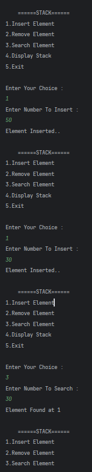

# Stack Operations in Java
A simple Java program demonstrating basic **Stack operations** such as inserting elements, removing elements, searching for elements, and displaying the stack.

---

## 📂 Files
- Main.java

---

## 🧠 Concept Used
- `Stack` class from `java.util` package  
- Push elements: `push()`  
- Pop elements: `pop()`  
- Search elements: `search()` (returns position from top, -1 if not found)  
- Display stack contents  
- Scanner for user input  
- Switch-case for menu-driven program  

---

## 📸 Screenshot
  

---

## 👨‍💻 Author
**Sujal Patil**  
📧 Email: sujalpatil21@gmail.com  
🌐 GitHub: [SujalPatil21](https://github.com/SujalPatil21)

